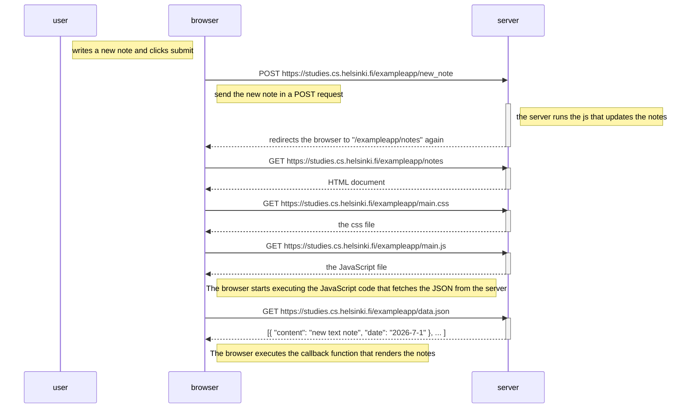

```mermaid
sequenceDiagram
    participant user
    participant browser
    participant server

    Note right of user: writes a new note and clicks submit

    browser->>server: POST https://studies.cs.helsinki.fi/exampleapp/new_note
    Note right of browser: send the new note in a POST request
    activate server
    Note right of server: the server runs the js that updates the notes 
    server-->>browser: redirects the browser to "/exampleapp/notes" again
    deactivate server

    browser->>server: GET https://studies.cs.helsinki.fi/exampleapp/notes
    activate server
    server-->>browser: HTML document
    deactivate server

    browser->>server: GET https://studies.cs.helsinki.fi/exampleapp/main.css
    activate server
    server-->>browser: the css file
    deactivate server

    browser->>server: GET https://studies.cs.helsinki.fi/exampleapp/main.js
    activate server
    server-->>browser: the JavaScript file
    deactivate server

    Note right of browser: The browser starts executing the JavaScript code that fetches the JSON from the server

    browser->>server: GET https://studies.cs.helsinki.fi/exampleapp/data.json
    activate server
    server-->>browser: [{ "content": "new text note", "date": "2026-7-1" }, ... ]
    deactivate server

    Note right of browser: The browser executes the callback function that renders the notes
```