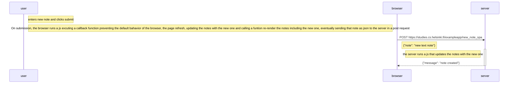

```mermaid
sequenceDiagram
    participant user
    participant browser
    participant server

    Note right of user: enters new note and clicks submit

    Note left of browser: On submission, the browser runs a js excuting a callback function  preventing the default bahavior of the browser, the page refresh, updating the notes with the new one and calling a funtion re-render the notes including the new one, eventually sending that note as json to the server in a post request

    browser->>server: POST https://studies.cs.helsinki.fi/exampleapp/new_note_spa
    Note right of browser: {"note": "new text note"}
    activate server
    Note left of server: the server runs a js that updates the notes with the new one 
    server-->>browser: {"message": "note created"}
    deactivate server
```